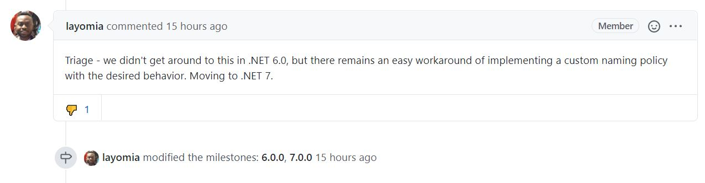

# JsonNamingPolicy
Naming policies for [System.Text.Json](https://docs.microsoft.com/en-us/dotnet/api/system.text.json?view=netcore-3.1)

This GitHub repo contains classes to change the name properties of a JSON into different naming conventions.

> **Update Jul 23 2021**
> 
> Microsoft has moved the implementation of kebab-case and snake_case to .NET 7
>
> 
>
> Additional information [here](https://github.com/dotnet/runtime/issues/782)


## NuGet Package

> **Update Oct 13 2021 - NuGet Package**
> **NickJohn** published 6 months ago, a NuGet Package with the code I share here.
> 
> You can incorporate the code easily inside of your developments.
> 
> You will find this NuGet Package **[here](https://www.nuget.org/packages/JorgeSerrano.Json.JsonSnakeCaseNamingPolicy)**
>  
> Thanks a lot **NickeJohn**
> 

## JsonSnakeCaseNamingPolicy
This class creates a policy to change the name properties of a JSON into SnakeCase (*snake_case*) used in some programming languages and APIs.

> This code passes the tests that you will find in the [corefx SnakeCaseUnitTests of Microsoft](https://github.com/hez2010/corefx/blob/c54ddc76da61c50576eff92e3add9caf7107f8af/src/System.Text.Json/tests/Serialization/SnakeCaseUnitTests.cs)

### Use

```csharp
var options = new JsonSerializerOptions() { PropertyNamingPolicy = new JsonSnakeCaseNamingPolicy() };
var person = new Person() { FirstName = "Jorge", Birthday = DateTime.UtcNow, MyJobCity = "Madrid" };
var json = JsonSerializer.Serialize(person, options);
```

### Result

```csharp
{"first_name":"Jorge","birthday":"2020-01-03T20:00:59.6991482Z","my_job_city":"Madrid"}
```

## JsonKebabCaseNamingPolicy
This class creates a policy to change the name properties of a JSON into KebabCase (*kebab-case*).

### Use

```csharp
var options = new JsonSerializerOptions() { PropertyNamingPolicy = new JsonKebabCaseNamingPolicy() };
var person = new Person() { FirstName = "Jorge", Birthday = DateTime.UtcNow, MyJobCity = "Madrid" };
var json = JsonSerializer.Serialize(person, options);
```

### Result

```csharp
{"first-name":"Jorge","birthday":"2020-01-03T20:00:59.6991482Z","my-job-city":"Madrid"}
```
